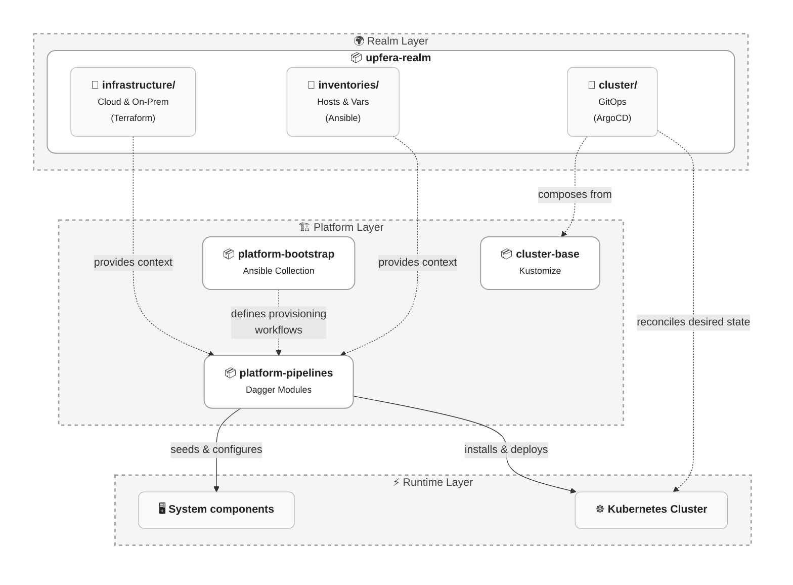

# Upfera Platform — GitHub Organization Overview

This GitHub organization contains the full infrastructure and platform engineering stack for the Upfera system. It is designed as a **realm-centric, multi-layer platform architecture** that separates concerns between platform capabilities, execution mechanics, and system state.

---

## 🧠 Core Concept: The Realm

A Realm is the atomic deployment boundary of the platform. It defines everything required to operate a full system, including infrastructure, configuration context, cluster topology, and application state.

Think of a Realm as equivalent to an AWS Account or a GCP Project, but extending beyond a single cluster boundary into a full system scope spanning infrastructure, clusters, and workloads.

A Realm is purely declarative – it defines *what should exist*, not *how it is provisioned or deployed*.

---

## 🏛️ Architecture Model

The system is built around a **Realm-Centric Platform Model**:

* The platform defines reusable capabilities.
* Pipelines execute provisioning and delivery workflows.
* Realms define the desired system state.
* Kubernetes clusters reconcile and materialize that state.

## 📦 Architectural Repositories & Layers

The repositories in this system map directly to the architectural layers defined above.

### 🌍 Realm Layer (System State)

**\<name>-realm/** (e.g., upfera-realm) — Declarative source of truth for system state. This is the authoritative definition of what should exist.

- **infrastructure/** → Declarative cloud and on-prem infrastructure definitions managed via Terraform or OpenTofu. Represents provider-level resources such as networks, IAM, compute, storage, and load balancers. Defines what infrastructure should exist, not how it is provisioned at runtime.

- **inventories/** → Ansible inventory definitions including host groups and configuration variables. Provides topology and execution context for provisioning workflows (e.g., regions, roles, cluster membership).

- **cluster-state/** → Declarative Kubernetes cluster state managed via GitOps (e.g., ArgoCD). Continuously reconciled with the live cluster runtime.

  - **bootstrap/** → Cluster bootstrap definitions responsible for establishing GitOps control over the cluster (e.g., ArgoCD installation, base controllers, CRDs).

  - **core/** → Baseline cluster infrastructure components and platform foundations (e.g., networking, ingress, observability, storage). Shared across all workloads.

  - **services/** → Platform-managed services and shared tooling configuration (e.g., monitoring, logging, security tooling). Consumed by workloads and platform components.

  - **apps/** → Application workloads deployed into the cluster. Contains business services defined via Kubernetes manifests and Kustomize overlays.

---

### 🏗️ Platform Layer (Capabilities)

Core reusable building blocks and execution mechanics.

- **platform-pipelines/** → Centralized Dagger modules used across the platform for CI/CD and workflow execution.
- **platform-bootstrap/** → Ansible playbooks for OS provisioning, host configuration, and Kubernetes cluster bootstrap.
- **cluster-base/** → Base Kubernetes cluster manifests defining foundational runtime components (CNI, Ingress, cert-manager, storage) and shared platform services (observability, logging, monitoring, telemetry).

---

### ⚡ Runtime Layer

The runtime layer represents the live execution environment where the desired state defined in Realms is materialized and continuously reconciled.

It consists of Kubernetes clusters and all running workloads, system components, and platform services operating in real time.

- Kubernetes clusters execute and continuously reconcile the desired state defined in `cluster-state/`.
- Workloads (applications and platform services) are deployed and managed within the cluster runtime.
- Platform controllers and GitOps systems ensure convergence between desired and actual state.
- The runtime layer is ephemeral and continuously evolving, driven by declarative state definitions.

---

## 🤖 AI Agents

The platform leverages AI agents to automate development and operations:

- **Junie** → Autonomous programmer for codebase management.
- **OpsAgent** → Automated infrastructure scaling and incident response.
- **SecurityAgent** → Vulnerability monitoring and automated patching.

For more details, see [AGENTS.md](../AGENTS.md).

---

## 🤝 Contribution & Community

We use standardized templates and configurations to maintain the platform.

- **Issue Templates** → Structured reporting for bugs and features.
- **Pull Request Template** → Standardized review process.
- **Security Policy** → Guidelines for reporting vulnerabilities.

These are managed in the `.github/` directory.